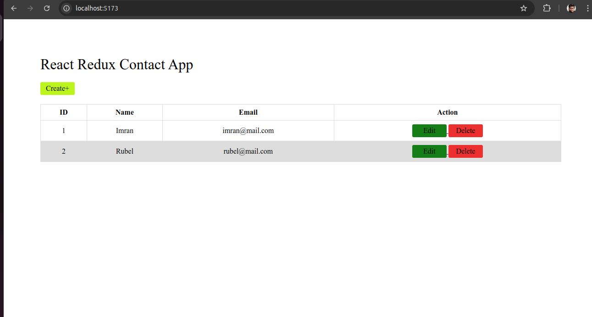
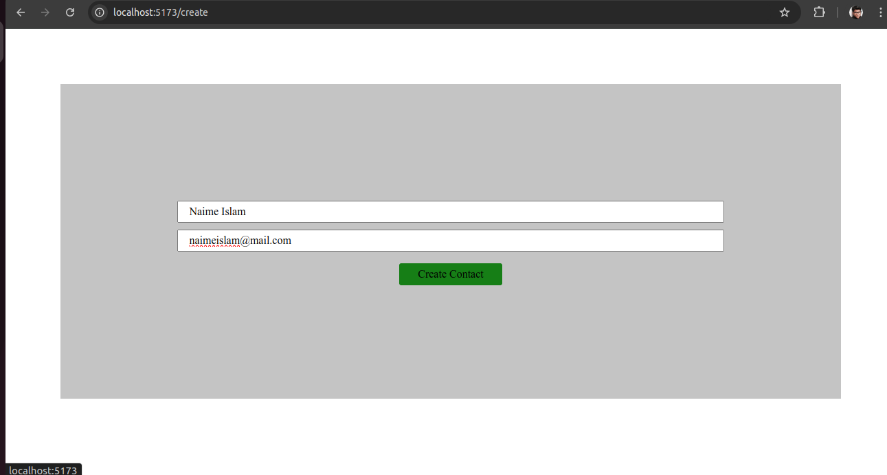
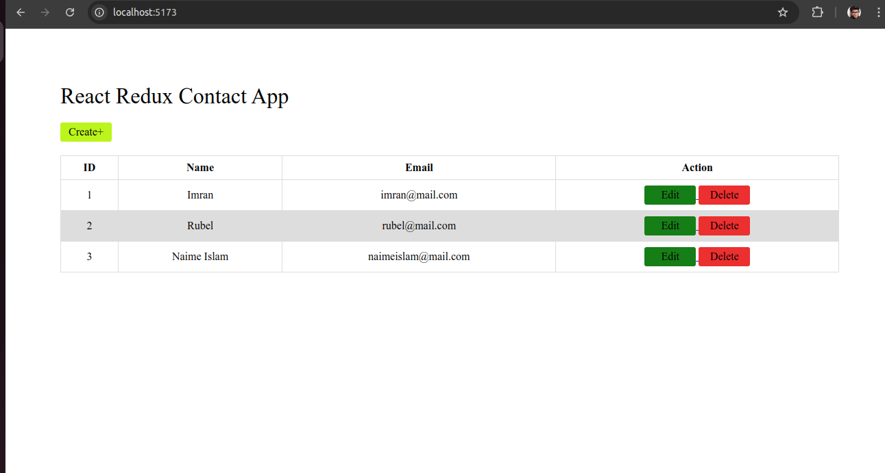
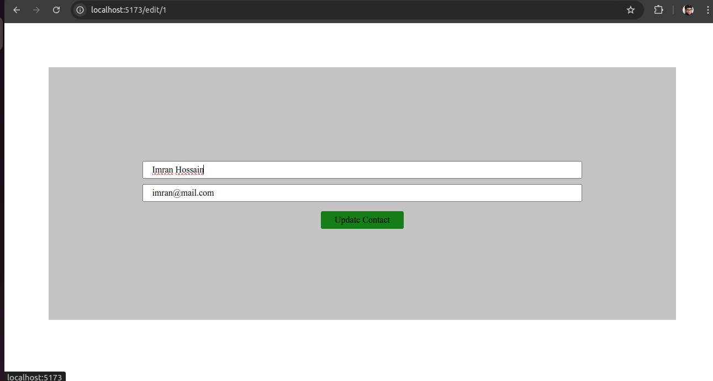
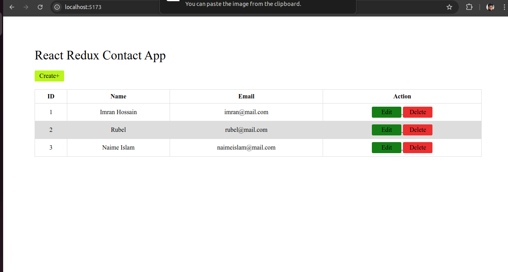
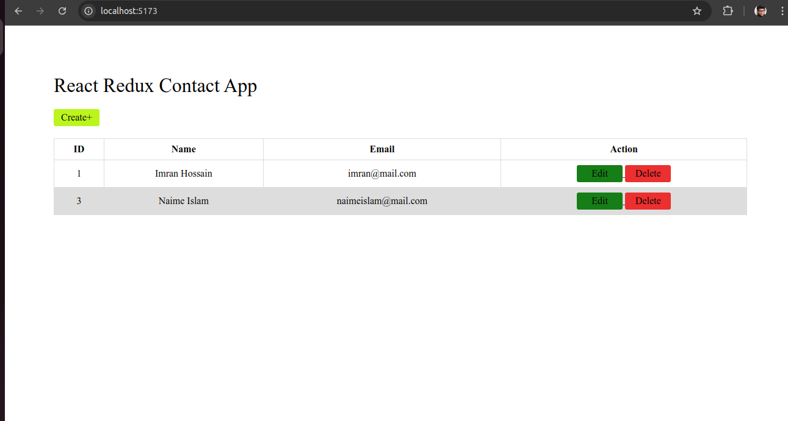

This is a Contact App using React-Redux-Toolkit.

Programming Language: Javascript

Used Libraries and frameworks:
  1. React
  2. React Router Dom
  3. React Redux Toolkit

This is the homepage where initial state will be viewd:

This is create new contact page:

This page is after create new contact:

This page is for edit/update contact:

This page is after update contact:

This page shows how to delete contact:

This is after delete a contact:

